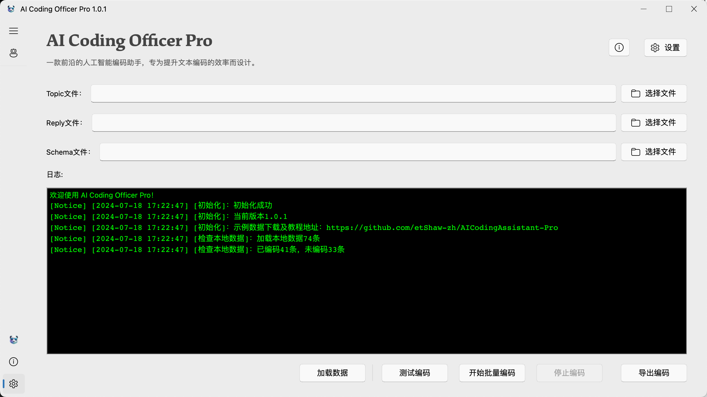

<p align="center">
    
    <br>
    <div align="center">
        
        
        
        
        
        <a href="https://doi.org/10.5281/zenodo.14227644"></a>
    </div>
</p>

<p align="center">
    English | <a href="docs/README_zh.md">简体中文</a>
</p>

## Introduction
AICO is a cutting-edge artificial intelligence coding assistant, designed to enhance the efficiency of text encoding.

Simply drag and drop data files onto the software interface to automatically encode the data without human intervention.

<p align="center">
    
</p>

## Name Explanation

- AI: Stands for "Artificial Intelligence", emphasizing the intelligent features of the tool.
- CO: Stands for "Coding Officer", indicating that AICO is a professional coding assistant capable of executing and supervising coding tasks.

## Core Values

- Intelligence: AICO utilizes Large Language Models (LLMs) technology to provide intelligent coding solutions.
- Efficiency: By automating and optimizing the coding process, AICO increases the speed of scientific research work.
- Reliability: AICO's algorithms ensure the accuracy and reliability of the encoding.

## Target Users

- Researchers
- Data Scientists
- Educators
- Any professionals in need of efficient text encoding support

## Features

- Multi-language support
- Customizable encoding rules
- User-friendly interface

## Installation

### Windows

1. Download the installation package: [AICodingOfficer_windows.zip](https://github.com/etShaw-zh/AICodingAssistant-Pro/releases)
2. Unzip the installation package
3. Run `AICodingOfficer.exe`

### macOS

1. Download the installation package: [AICodingOfficer_macOS.zip](https://github.com/etShaw-zh/AICodingAssistant-Pro/releases)
2. Unzip the installation package
3. Run `AICodingOfficer.app`

    ⚠️  Solving the issue of "Application 'xxx' cannot be opened" on Mac

    - First, right-click on the application and select 'Show Package Contents'
    - Then, expand 'Contents' - 'MacOS', find the corresponding file AICodingOfficer
    - Next, open the terminal and enter the following code (note that there are spaces before and after +x):
        
        ```shell
        chmod +x
        ```
        
    - Then drag the file AICodingOfficer into the terminal (to input the complete execution path). The complete command is as follows:
        
        ```shell
        chmod +x /Users/xiaojianjun/Downloads/AICodingOfficer.app/Contents/MacOS/AICodingOfficer
        ```

    - Finally, press Enter. At this point, the file that was originally of unknown type in Finder has now become a Unix executable file, and the icon has also become normal.
    - Reopen the downloaded software, and you will find that the downloaded program can be used and executed normally!
    - If it still cannot be opened, go to Settings, Security & Privacy, find the prompt information, and click to run and open it.

    📖  Tutorial: [How to solve the issue of "Application 'xxx' cannot be opened" on macOS](https://sspai.com/post/52828#!) 

## User Guide

⚠️User guide detail：[AICO user guide](https://aicodingassistant-pro.readthedocs.io/en/latest/index.html)

## Citation
Xiao, J. (2024). etShaw-zh/AICodingAssistant-Pro: A cutting-edge artificial intelligence text classification assistant (v1.0.4) [Software]. Zenodo. https://doi.org/10.5281/zenodo.14227645
    
```bibtex
@software{jianjun_xiao_2024_14227645,
author       = {Jianjun Xiao},
title        = {{etShaw-zh/AICodingAssistant-Pro: a cutting-edge artificial intelligence text classification assistant}},
month        = nov,
year         = 2024,
publisher    = {Zenodo},
version      = {v1.0.4},
doi          = {10.5281/zenodo.14227645},
url          = {https://doi.org/10.5281/zenodo.14227645}
}
```

## Contact Information

- **WeChat:** etshaw8888

- **Personal Homepage:** https://xiaojianjun.cn 

- **WeChat Official Account:** EdTech肖建军

- **Email:** et_shaw@126.com

- **Address:** Room 1005A, Block C, Science and Technology Building, Beijing Normal University

<p align="center">
    
</p>
