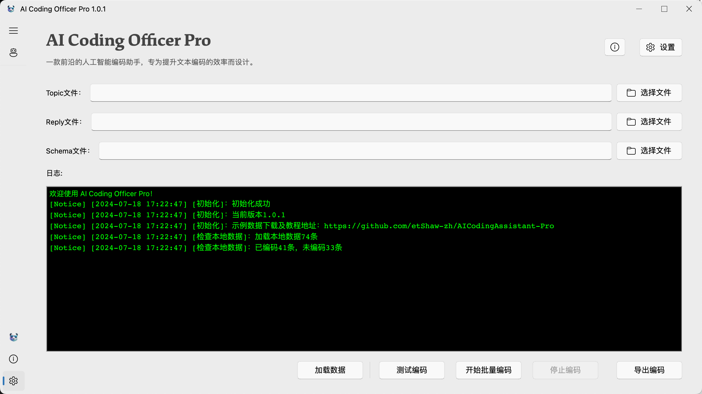

<p align="center">
    
    <br>
    <div align="center">
        
        
        
        
        
        <a href="https://doi.org/10.5281/zenodo.14227644"></a>
    </div>
</p>

<p align="center">
    <a href="/README.md">English</a> | 简体中文
</p>

## 介绍
AICO 是一款前沿的人工智能编码助手，专为提升文本编码的效率而设计。

仅需拖动数据文件至软件界面，即可自动对数据进行编码，无需人工干预。

<p align="center">
    
</p>

## 名称解释

- AI: 代表 "Artificial Intelligence"，强调工具的智能特性。
- CO: 代表 "Coding Officer"，意味着 AICO 是一个专业的编码助手，能够执行和监督编码任务。

## 核心价值

- 智能: AICO 利用Large Language Models (LLMs)技术提供智能编码解决方案。
- 效率: 通过自动化和优化编码流程，AICO 提高了科研工作速度。
- 可靠: AICO 的算法确保了编码的准确性和可靠性。

## 目标用户

- 科研人员
- 数据科学家
- 教育工作者
- 任何需要高效文本编码支持的专业人士

## 功能特点

- 多语言支持
- 定制编码规则
- 用户友好的交互界面

## 安装

### Windows

1. 下载安装包：[AICodingOfficer_windows.zip](https://github.com/etShaw-zh/AICodingAssistant-Pro/releases)
2. 解压安装包
3. 运行 `AICodingOfficer.exe`

### macOS

1. 下载安装包：[AICodingOfficer_macOS.zip](https://github.com/etShaw-zh/AICodingAssistant-Pro/releases)
2. 解压安装包
3. 运行 `AICodingOfficer.app`

    ⚠️  解决Mac 上「应用程序 “xxx” 不能打开」的问题

    - 首先在应用上点击右键，选择「显示包内容」
    - 之后依次展开「Contents」-「MacOS」，找到对应文件夹下的文件 AICodingOfficer
    - 接下来打开终端，直接输入以下代码（注意 +x 前后都有空格）：
        
        ```shell
        chmod +x
        ```
        
    - 之后再将文件 AICodingOfficer 拖入终端（为了输入完整的执行路径）。完整的命令如下：
        
        ```shell
        chmod +x /Users/xiaojianjun/Downloads/AICodingOfficer.app/Contents/MacOS/AICodingOfficer
        ```

    - 最后点击回车，这时候在访达中原本不明类型的文件现在变成了 Unix 可执行文件，图标也变成正常的了。
    - 重新打开下载的软件，你会发现下载的程序可以正常使用并执行了！
    - 仍然无法打开的话，进入设置，安全性与隐私，找到提示信息，点击运行打开即可。

    📖  图文教程：[macOS 上「应用程序 “xxx” 不能打开」的解决方法](https://sspai.com/post/52828#!)

## 使用指南

⚠️详细教程请参考：[AICO使用指南](https://aicodingassistant-pro.readthedocs.io/en/latest/index.html)

## 引用信息
Xiao, J. (2024). etShaw-zh/AICodingAssistant-Pro: A cutting-edge artificial intelligence text classification assistant (v1.0.4) [Software]. Zenodo. https://doi.org/10.5281/zenodo.14227645
    
```bibtex
@software{jianjun_xiao_2024_14227645,
author       = {Jianjun Xiao},
title        = {{etShaw-zh/AICodingAssistant-Pro: a cutting-edge artificial intelligence text classification assistant}},
month        = nov,
year         = 2024,
publisher    = {Zenodo},
version      = {v1.0.4},
doi          = {10.5281/zenodo.14227645},
url          = {https://doi.org/10.5281/zenodo.14227645}
}
```

## 联系方式

- **微信：** etshaw8888

- **个人主页：** https://xiaojianjun.cn

- **微信公众号：** EdTech肖建军

- **邮箱：** et_shaw@126.com

- **地址：** 北京师范大学科技楼C区1005A室

<p align="center">
    
</p>
